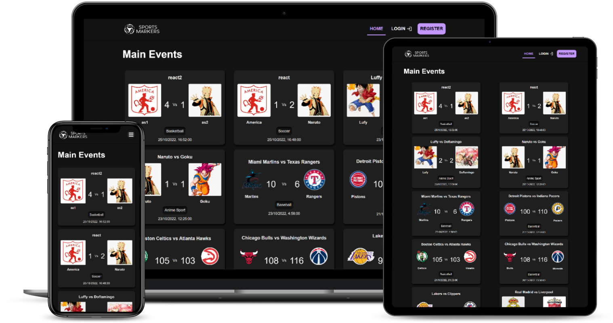

# Sports Markers

Final project of cycle 4: Development of web applications, of the MisionTIC 2022 program.

## Description

This project is a website where users will be able to view the sports scores of the main events created by other users and/or consumed from an external API.

Users registered on the platform will be able to access their user panel, where they will be able to view all registered matches in descending order (from the most recent to the oldest). In addition, they will be able to add new events to the platform, providing the date, the participating teams, the score and the corresponding type of sport. They will also have the option to update and delete their own events registered on the platform. 

The user session makes use of authentication tokens that will be validated at each page load to ensure the security of the platform. This token will be a JWT or Json Web Token, managed from the backend and communicated through the Authorization header.

## Technologies

This project makes use of the MongoDB database to store the data of users, events, teams and sports. In addition, it uses NodeJs and Express for the backend and the ReactJS library for the frontend. CSS is used for styling and layout.

## Demo

This project is deployed in Vercel: [See demo](https://sports-markers.vercel.app/)



## Installation

To use the project locally:

1. Clone the repository on your local machine: 
```bash
git clone https://github.com/EudesSerpa/sports-markers-front.git
```

2. Change directory:
```bash
cd sports-markers-front
```

3. Install the dependencies: 
```bash
npm install
```

4. Start the application: 
```bash
npm run dev
```

### Considerations

This project needs its backend which is at [backend](https://github.com/EudesSerpa/sports-markers).

## Usage

Once the application is running, you can view it from your browser at http://localhost:5173/.
